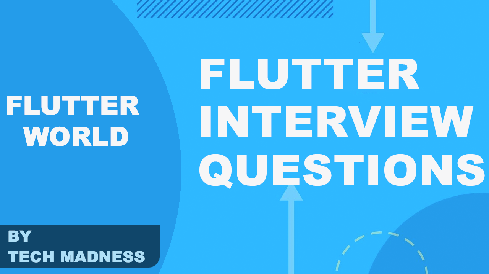

Flutter is a new platform that everyone is still learning that is why most of the devs not able to find what to prepare for Flutter interview. This blog is helpful for both interviewer and candidate.

 

Following are the types of questions asked in the interview.
1. Life Cycle & Routes
2. Widgets
3. Async operations
4. Storage
5. Platform Specific Android/iOS
6. Dart
7. Architecture
8. Test Cases

some also related to assets, firebase, etc…

# 1. Life Cycle & Routes
- Why Flutter? over other platforms?
- What is a Widget in Flutter? Why Flutter doesn’t have other files like XML, styles, etc…?
- Difference between a StatelessWidget and a StatefulWidget in Flutter?
- Explain the Stateful Widget Lifecycle?
- How Flutter Lifecycle different from the Android/iOS life cycle?
- How build() method works? How it rebuild itself?
- Does a new state object is created if the widget re-build?
- What is a Navigator and what are Routes in Flutter?
- What are the trees available in Flutter? Eg: Widget Tree, Element Tree…
- What is the ephemeral state? and Differentiate between ephemeral state and app state? [Learn from here](https://flutter.dev/docs/development/data-and-backend/state-mgmt/ephemeral-vs-app)
- When do we use the WidgetsBindingObserver?
- Difference between SchedulerBinding and WidgetBinding? [Learn from here](https://medium.com/flutterworld/flutter-schedulerbinding-vs-widgetsbinding-149c71cb607f)
- How would you access StatefulWidget properties from its State?
- If the child widget gets re-initialized, does it also re-initialize the parent widget?
- How to re-initialize parent widget from child widget? Explain several ways?
# 2. Widgets
- What would happen if I converted a stateless widget to Stateful Widget? Is there any performance issue?
- Flexible Vs Expanded
- SizeBox VS Container?
- What is a Spacer widget?
- How to show/hide widgets?
- What is the importance of a TextEditingController?
- How to shift focus to next TextField in flutter?
- List the Visibility widgets in flutter and the differences?
- What are the ways to get data from called Widget?
- Why ListView inside Column not works?
- Differentiate between Listview and Listview.Builder
- How to scroll to a position in Flutter ListView?
- How to place a listview inside a SingleChildScrollView but prevent them from scrolling separately?
- How can you update a ListView dynamically?
- When to use ShrinkWrap the property?
- Why do we use a Reverse property in a Listview?
- What is an UnmodifiableListView?
- How to draw Text over Image?
- What are keys in Flutter and when should you use it?
- What are GlobalKeys?
- When should you use mainAxisAlignment and crossAxisAlignment?
- When can you use double.INFINITY?
- When to use a mainAxisSize?
- What is the purpose of a SafeArea?
- How to assign min-height to the widget? link
- How to align two items on extremes — one on the left and one on the right?
- Mention two or more operations that would require you to use or return a Future.
- Can we use Color and Decoration property simultaneously in the Container? Explain
- In order for the CrossAxisAlignment.baseline to work what is another property that we need to set?
- When should we use a resizeToAvoidBottomInset?
- Difference between a Modal and Persistent BottomSheet with an example?
- How is an Inherited Widget different from a Provider?
- What is an InheritedWidget? List some examples.
- When to use Intrinsic height?
- When to use Custom ScrollView?
- Difference between GestureDetector and InkWell?
- What is a vsync?
- Difference between `AnimationController and Animation?
- When to use a SingleTickerProviderStateMixin and TickerProviderStateMixin?
- What is Ticker, Tween and AnimatedBuilder?
- What is an AspectRatio widget used for?
- What is the purpose of ModalRoute.of()?
- Difference between RemoveUtil and PopUtil in Flutter navigation?
- Difference between a Navigator.pushNamed and Navigator.pushReplacementNamed?
- What is the use of WidgetsBinding class?

# 3. Async operations
- Explain async, await , thenand Futures.
- Why build re-triggering again and again? How to scroll to a position in Flutter ListView?
- Why FutureBuildercalled multiple times? how to resolve this?
- What’s the difference between async and async* in Dart?
- What is a Stream?
- Differentiate between StreamBuilder and FutureBuilder
- What is the difference between FutureBuilder and await?
- What are the ways to use Future Object?
- How to group multiple Streams?
- Why in this code, await is not blocking UI?
- How to perform Syncrnonization in Flutter?
- Differentiate between Provider and Consumer ?
- How to run foreground services?
- How to schedule a job after specific intervals?
- Difference between whenCompleted() and then().
- How to run code after Build() method execution?

# 4. Storage

- Why SharedPreference commit method is deprecated?
- How to persist data in Database ?

# 5. Platform Specific Android/iOS
- How platform channel works?

# 6. Dart
- Difference between these operators “?? and ?.”
- Difference between Constand final? Is there any performance issue If I select one of them over another?
- What is Extention and how to use it with the existing code?
- What is typedef in Dart?
- How to handle null conditions? and use of the ‘??’ operator.
- Use of ‘=>’ operator?
- Differentiate between forEachand whereclause
- What is the advantage of Factory constructor?
- Why dialog inside FutureBuilder not working?

# 7. Architecture
- How to use Bloc architecture?
- How to use MVVM architecture?
- Difference between Bloc vs MVVM ?
- What are the different state management techniques?

# 8. Test Cases
- How to mock objects? which classes used to do that?
- How to verify httprequest callbacks?
- How to catch the Exceptions?
- Distinguish between unit and UI test cases?

# Others
- If we change localization to the RTL language, is it changed according to language direction
- Difference between getDocuments() vs snapshots() in Firebase?
- What is the difference between hot restart and hot reload?
- How to deal with unwanted widget build?
- What is the difference between flutter package and flutter plugin.
- What is the use of addPostFrameCallback ?
- What is the difference between ‘as’,’ show’ and ‘hide’ in an import statement?
- Difference between a Single Instance and Scoped Instance ?
- When Bad State Exception occurs?
- What is a pubspec file in Dart?


### Next questions coming soon….


### Found this project useful :heart:

* Support by clicking the :star: button on the upper right of this page. :v:

### License
```
   Copyright (C) 2020 MINDORKS NEXTGEN PRIVATE LIMITED

   Licensed under the Apache License, Version 2.0 (the "License");
   you may not use this file except in compliance with the License.
   You may obtain a copy of the License at

       http://www.apache.org/licenses/LICENSE-2.0

   Unless required by applicable law or agreed to in writing, software
   distributed under the License is distributed on an "AS IS" BASIS,
   WITHOUT WARRANTIES OR CONDITIONS OF ANY KIND, either express or implied.
   See the License for the specific language governing permissions and
   limitations under the License.
```

### Contributing to Android Interview Questions
Just make [pull request](https://github.com/jitsm555/Flutter-Interview-Questions/compare). You are in!
